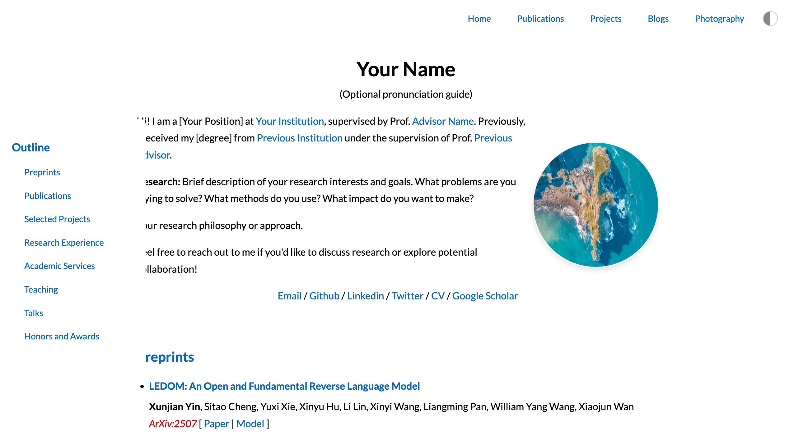

# Academic Homepage Template


A clean, modern, and responsive academic homepage template featuring dark mode support, mobile-friendly design, and comprehensive sections for publications, projects, and more.

- Demo Link: [Academic-Homepage-Template](https://arvid-pku.github.io/Academic-Homepage-Template/index.html)
- Customization Guide: [Academic-Homepage-Template/CUSTOMIZATION.md](Academic-Homepage-Template/CUSTOMIZATION.md)
- Author Homepage: [Xunjian Yin](https://xunjianyin.github.io/)



## Features

- **Responsive Design**: Works seamlessly on desktop, tablet, and mobile devices
- **Dark Mode**: Built-in theme toggle with system preference detection
- **Modern UI**: Clean, professional design with smooth animations
- **SEO Optimized**: Proper meta tags, structured data, and semantic HTML
- **Accessibility**: WCAG compliant with keyboard navigation and screen reader support
- **Performance**: Optimized loading with lazy loading and efficient CSS
- **Easy Customization**: Well-organized code structure for easy modifications

## Fork and Deploy to GitHub Pages

The easiest way to get started is to fork this template and deploy it directly to GitHub Pages:

### Option 1: Fork and Deploy (Recommended)

1. **Fork this repository** to your GitHub account
2. **Rename the repository** to `yourusername.github.io` (replace `yourusername` with your actual GitHub username)
3. **Clone your fork** to your local machine:
   ```bash
   git clone https://github.com/yourusername/yourusername.github.io.git
   cd yourusername.github.io
   ```
4. **Customize the content** (see [Quick Start](#quick-start) section below)
5. **Commit and push your changes**:
   ```bash
   git add .
   git commit -m "Customize homepage with my information"
   git push origin main
   ```
6. **Enable GitHub Pages** in your repository settings (Settings → Pages → Source: Deploy from a branch → Branch: main)
7. **Your website will be live** at `https://yourusername.github.io`

### Option 2: Download and Upload

1. **Download this template** as a ZIP file
2. **Extract and customize** the files locally
3. **Create a new repository** named `yourusername.github.io`
4. **Upload your customized files** to the repository
5. **Enable GitHub Pages** as described above

### GitHub Pages Configuration

Once your repository is set up:
- Your site will automatically update when you push changes to the main branch
- It may take a few minutes for changes to appear live
- You can use a custom domain by adding a `CNAME` file to your repository

## File Structure

```
homepage-template/
├── index.html              # Main homepage
├── publications.html       # Publications page
├── projects.html          # Projects showcase
├── blogs.html             # Blog posts
├── photography.html       # Photography portfolio
├── data.js               # Your content data
├── config.js             # Website configuration
├── main.js               # Core functionality
├── stylesheet.css        # Main styles
├── shared-styles.css     # Shared component styles
├── figures/
│   ├── me.jpg           # Your profile photo
│   └── logo.png         # Website logo/favicon
├── files/
│   └── CV.pdf           # Your CV/Resume
├── photos/
│   └── project-demo/    # Project demonstration images
├── blogs/               # Blog post files
└── README.md            # This file
```

## Quick Start

1. **Download the template** to your desired directory
2. **Replace placeholder content** with your information:
   - Edit `data.js` with your publications, projects, and experience
   - Update personal information in `index.html`
   - Replace placeholder images in `figures/` folder
3. **Customize styling** (optional):
   - Modify colors in `config.js`
   - Adjust layouts in CSS files
4. **Deploy** to your web server or GitHub Pages

## Content Customization

### Personal Information (index.html)

Update the following placeholders in `index.html`:

```html
<!-- Replace these with your information -->
<title>Your Name</title>
<meta name="description" content="Your description here">
<name>Your Name</name>
<!-- Update structured data in the JSON-LD script -->
```

### Publications & Projects (data.js)

Edit the `data.js` file to add your publications and projects:

```javascript
const publications = [
  {
    title: "Your Paper Title",
    authors: "<b>Your Name</b>, Co-Author",
    venue: "Conference/Journal Name",
    links: [
      { text: "Paper", url: "paper-url" },
      { text: "Code", url: "code-url" }
    ],
    isPreprint: false,
    isSelected: true
  }
];

const projects = [
  {
    title: "Your Project",
    description: "Project description with <a href='#'>links</a>",
    badges: [
      { url: "github-url", img: "badge-image-url" }
    ],
    isSelected: true,
    demoPath: "photos/project-demo/your-project.png"
  }
];
```

### Research Experience & Other Sections

Update the following arrays in `data.js`:
- `researchExperience`
- `teaching`
- `academicServices`
- `talks`
- `honors`

## Customization

### Colors & Styling

Modify the color scheme in `config.js`:

```javascript
const CONFIG = {
  colors: {
    primary: '#0065C0',      // Main accent color
    secondary: '#f09228',    // Secondary accent
    text: '#000000',         // Text color
    background: '#FFFFFF',   // Background color
    // ... more colors
  }
};
```

### Adding New Sections

1. Add the section to your HTML file
2. Create corresponding data in `data.js`
3. Add a population function in `main.js`
4. Update the outline sidebar if needed

### Navigation

To modify the navigation menu, edit the nav section in each HTML file:

```html
<nav class="nav-buttons">
  <a href="index.html" class="nav-button">Home</a>
  <a href="your-new-page.html" class="nav-button">New Page</a>
  <!-- Add more navigation items -->
</nav>
```

## Responsive Design

The template is fully responsive with breakpoints at:
- **Mobile**: ≤ 600px
- **Tablet**: 601px - 768px
- **Desktop**: > 768px

## Dark Mode

Dark mode is automatically enabled based on system preferences and can be toggled using the theme button. The preference is saved in localStorage.

## Advanced Features

### Visitor Map

The template includes a lazy-loaded visitor map. To set up your own map:

1. Get your map code from [ClustrMaps](https://clustrmaps.com/)
2. Replace the map script URL in `main.js`

### Blog System

The blog section is ready for integration with:
- Static blog generators (Jekyll, Hugo, etc.)
- Markdown files
- External blog platforms

### SEO Optimization

The template includes:
- Open Graph tags for social media
- Twitter Card support
- Structured data (JSON-LD)
- Semantic HTML structure
- Proper heading hierarchy

## Deployment

### GitHub Pages

1. Create a new repository named `yourusername.github.io`
2. Upload your customized template files
3. Enable GitHub Pages in repository settings
4. Your site will be available at `https://yourusername.github.io`

### Other Platforms

The template works with any static hosting service:
- Netlify
- Vercel
- AWS S3
- Traditional web hosting

## Performance Tips

1. **Optimize images**: Compress your photos and use appropriate formats
2. **Minimize HTTP requests**: Combine CSS/JS files if needed
3. **Enable caching**: Configure proper cache headers on your server
4. **Use CDN**: Consider using a CDN for faster global delivery

## Troubleshooting

### Common Issues

**Images not loading**: Check file paths and ensure images are uploaded to the correct directories.

**Dark mode not working**: Verify that the theme toggle JavaScript is loaded and localStorage is available.

**Mobile menu not opening**: Ensure all JavaScript files are properly loaded and there are no console errors.

**Publications not displaying**: Check the `data.js` file for syntax errors and ensure the data structure matches the expected format.

## Contributing

Feel free to submit issues and enhancement requests! If you make improvements to the template, consider sharing them with others.

## License

This template is free to use for academic and personal purposes. Attribution is appreciated but not required.

## Support

If you need help customizing this template, feel free to:
1. Check the troubleshooting section above
2. Review the code comments for guidance
3. Create an issue if you find bugs or have questions

---

**Happy building!**
